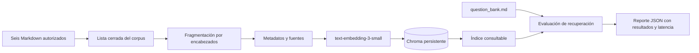
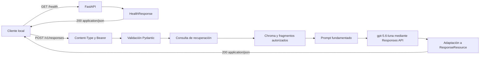
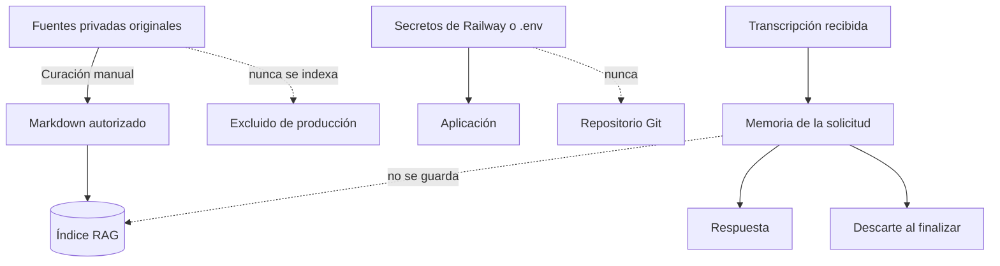
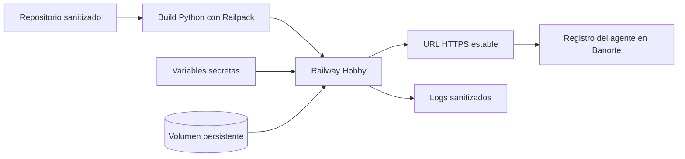

# Arquitectura y flujo de la solución

## 1. Propósito y estado de D09

Este documento registra el flujo del agente profesional y relaciona cada componente con el código que lo implementa.

**Estado de D09:** En progreso  
**Fecha de actualización:** 2026-08-18

La ingestión, fragmentación, almacenamiento vectorial, recuperación, evaluación y comprobación de salud ya tienen una implementación local. `POST /v1/responses` integra validación Pydantic, autenticación Bearer, recuperación RAG, prompt fundamentado y generación con `gpt-5.6-luna` en modalidades JSON completa y streaming SSE. Ambos flujos fueron validados localmente; D09 permanecerá en progreso hasta desplegar el incremento SSE y contrastarlo con una solicitud real de Banorte.

## 2. Flujo objetivo de una solicitud

```mermaid
flowchart LR
    B[Plataforma Banorte] -->|HTTPS + Bearer| API[POST /responses]
    API --> VA[Validación y autenticación]
    VA --> ORI[Normalización Open Responses]
    ORI --> HC[Historial recibido en la solicitud]
    HC --> RAG[Servicio RAG]
    RAG --> EQ[Embedding de la consulta]
    EQ --> VS[(Chroma)]
    VS --> CR[Contexto recuperado]
    CR --> PR[Prompt fundamentado]
    PR --> PM[Adaptador del modelo]
    PM --> OA[OpenAI]
    PM -. contingencia .-> AN[Anthropic]
    OA --> RI[Respuesta interna normalizada]
    AN --> RI
    RI --> ORO[Adaptador Open Responses]
    ORO -->|JSON completo si stream=false| B
    ORO -->|SSE si stream=true| B

    classDef implemented fill:#d1fae5,stroke:#047857,color:#064e3b;
    classDef partial fill:#fef3c7,stroke:#b45309,color:#78350f;
    classDef planned fill:#fee2e2,stroke:#b91c1c,color:#7f1d1d;

    class API,VA,ORI,HC,RAG,EQ,VS,CR,PR,PM,OA,RI,ORO implemented;
    class B partial;
    class AN planned;
```

### Leyenda

- **Verde:** componente implementado y probado localmente.
- **Amarillo:** estructura o dependencia existente, pendiente de integrarse al endpoint.
- **Rojo:** componente todavía no implementado.

## 3. Flujo implementado de construcción del índice

Este flujo está implementado mediante:

- `app/rag/chunking.py`: selección del corpus, fragmentación, metadatos e identificadores estables.
- `app/rag/embeddings.py`: adaptador de embeddings de OpenAI.
- `app/rag/vector_store.py`: persistencia y búsqueda coseno en Chroma.
- `app/rag/service.py`: construcción del índice, recuperación, diversidad por documento y reranking híbrido ligero por especificidad de fuente y coincidencia léxica.
- `app/rag/evaluation.py`: lectura reproducible del banco de preguntas y validación por documento permitido más trazabilidad `SRC-*`.
- `scripts/build_index.py`: construcción controlada del índice.
- `scripts/evaluate_retrieval.py`: evaluación y generación del reporte.

## 4. Flujo ejecutable actual de la API

Actualmente `app/main.py` expone `GET /health` y `POST /v1/responses`. La segunda ruta ejecuta el recorrido real completo o incremental según `stream`. El modelo se fija mediante configuración del servidor, el historial se procesa sin persistencia y el uso de tokens se refleja en la respuesta pública final.

## 5. Correspondencia entre arquitectura y código

| Componente | Archivo o evidencia | Estado |
|---|---|---|
| Configuración por entorno | `app/config.py`, `.env.example` | Implementado |
| Endpoint de salud | `app/main.py`, `tests/test_health.py` | Implementado y probado |
| Corpus autorizado | `app/rag/chunking.py` | Implementado y probado |
| Fragmentación y metadatos | `app/rag/chunking.py`, `tests/test_chunking.py` | Implementado y probado |
| Embeddings de documentos y consulta | `app/rag/embeddings.py` | Implementado; ejecución real depende de la clave y cuota |
| Chroma y similitud coseno | `app/rag/vector_store.py`, `tests/test_vector_store.py` | Implementado y probado localmente |
| Recuperación, diversidad y reranking | `app/rag/service.py`, `tests/test_service.py` | Implementado y probado |
| Evaluación de recuperación | `scripts/evaluate_retrieval.py`, `tests/test_evaluation.py`, `artifacts/evaluations/retrieval-20260818-221152.json` | Implementada y aprobada: 49 casos, Hit@4 100 %, Top-1 81.63 %, MRR@4 90.48 % |
| `POST /v1/responses` | `app/main.py`, `app/agent.py`, `tests/test_responses.py` | Implementado con RAG y generación real completa o streaming |
| Validación del contrato Open Responses | `app/models.py`, `tests/test_models.py`, `tests/test_responses.py` | Implementación inicial probada; aceptación real de Banorte pendiente |
| Autenticación Bearer | `app/auth.py`, `app/config.py`, `tests/test_auth.py` | Implementada y probada localmente; integración con Banorte pendiente |
| Historial stateless | `app/agent.py`, `tests/test_agent.py` | Implementado para reproducción de transcripción |
| Prompt fundamentado | `app/prompts.py`, `tests/test_agent.py` | Implementado y probado sin red |
| Adaptador de generación OpenAI | `app/llm.py`, `tests/test_llm.py` | Implementado con `gpt-5.6-luna`; llamada real local validada |
| Contingencia Anthropic | Decisiones D02 y D03 | Pendiente |
| Respuesta JSON completa | `app/main.py`, `tests/test_responses.py` | Implementada con respuesta real y uso de tokens |
| Streaming SSE | `app/main.py`, `app/agent.py`, `app/llm.py`, `app/open_responses.py`, `tests/test_responses.py` | Implementado y validado localmente; despliegue y aceptación de Banorte pendientes |
| Contenedor Docker | Decisión D08 | Pendiente |
| Despliegue Railway | `railway.json`, `.python-version`, `scripts/ensure_index.py` | API base desplegada; el nuevo incremento y la persistencia del índice deben validarse |

## 6. Límites de seguridad y privacidad

- El índice incluye exclusivamente los seis documentos autorizados por D04.
- Los documentos originales y los archivos de preguntas o dudas no forman parte del índice.
- `AGENT_API_KEY` protege la entrada y es distinta de `OPENAI_API_KEY`.
- El historial conversacional vive solamente durante la solicitud.
- Chroma conserva conocimiento profesional, no conversaciones.
- Los logs no deberán incluir claves ni transcripciones completas.

## 7. Flujo objetivo de despliegue

Railway deberá mantener Serverless desactivado durante la evaluación. El volumen conservará `data/chroma`, mientras que las fuentes Markdown versionadas permitirán reconstruir el índice si fuera necesario.

## 8. Criterios pendientes para terminar D09

D09 podrá marcarse como terminado cuando:

- Exista `POST /responses` y su recorrido real corresponda con el flujo documentado.
- La autenticación Bearer, validación, RAG, modelo y adaptación se relacionen con archivos y pruebas concretas.
- El diagrama elimine o actualice todos los componentes marcados como pendientes.
- Las modalidades JSON completa y SSE funcionen desde Banorte.
- La URL, volumen, secretos y logs de Railway coincidan con el diagrama de despliegue.
- Cualquier diferencia entre diseño y código se corrija en el código o en este documento.

## 9. Evidencia actual

- Decisiones arquitectónicas: `docs/decisiones.md`.
- Contrato preliminar: `docs/contrato-open-responses.md`.
- Requisitos: `docs/requisitos.md`.
- Alcance: `docs/alcance-mvp.md`.
- Evaluación RAG aprobada: `artifacts/evaluations/retrieval-20260818-221152.json`.
- API base pública: `https://agentecv-production.up.railway.app`.
- Estado para continuidad: `ESTADO_IMPLEMENTACION.md`.
- Pruebas automatizadas: carpeta `tests/`.
