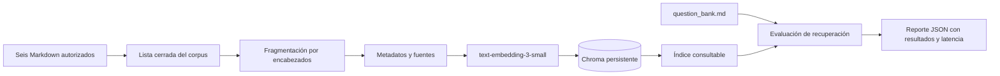
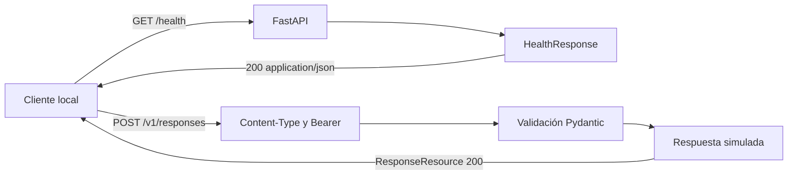
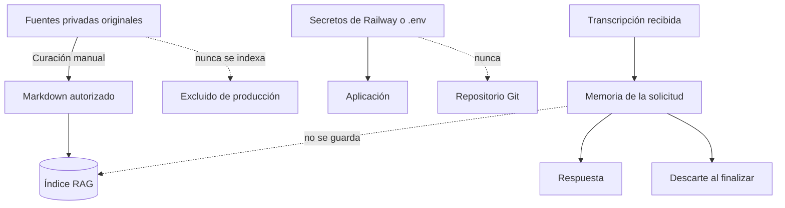
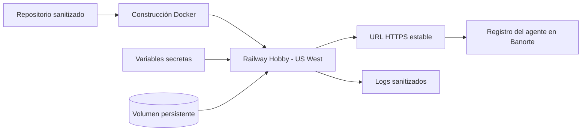

# Arquitectura y flujo de la solución

## 1. Propósito y estado de D09

Este documento registra el flujo del agente profesional y relaciona cada componente con el código que lo implementa.

**Estado de D09:** En progreso  
**Fecha de actualización:** 2026-08-18

La ingestión, fragmentación, almacenamiento vectorial, recuperación, evaluación y comprobación de salud ya tienen una implementación local. `POST /v1/responses` también existe con validación Pydantic, autenticación Bearer y una respuesta simulada no streaming. Su integración RAG y generación con el modelo todavía están pendientes. Por ese motivo, D09 no se considerará terminado hasta contrastar el flujo extremo a extremo con una solicitud real de Banorte.

## 2. Flujo objetivo de una solicitud

```mermaid
flowchart LR
    B[Plataforma Banorte] -->|HTTPS + Bearer| API[POST /responses]
    API --> VA[Validación y autenticación]
    VA --> ORI[Normalización Open Responses]
    ORI --> HC[Historial recibido en la solicitud]
    HC --> RAG[Servicio RAG]
    RAG --> EQ[Embedding de la consulta]
    EQ --> VS[(Chroma)]
    VS --> CR[Contexto recuperado]
    CR --> PR[Prompt fundamentado]
    PR --> PM[Adaptador del modelo]
    PM --> OA[OpenAI]
    PM -. contingencia .-> AN[Anthropic]
    OA --> RI[Respuesta interna normalizada]
    AN --> RI
    RI --> ORO[Adaptador Open Responses]
    ORO -->|JSON completo| B
    ORO -. si Banorte lo exige .->|SSE| B

    classDef implemented fill:#d1fae5,stroke:#047857,color:#064e3b;
    classDef partial fill:#fef3c7,stroke:#b45309,color:#78350f;
    classDef planned fill:#fee2e2,stroke:#b91c1c,color:#7f1d1d;

    class API,VA,RAG,EQ,VS implemented;
    class ORI,HC,CR partial;
    class B,PR,PM,OA,AN,RI,ORO planned;
```

### Leyenda

- **Verde:** componente implementado y probado localmente.
- **Amarillo:** estructura o dependencia existente, pendiente de integrarse al endpoint.
- **Rojo:** componente todavía no implementado.

## 3. Flujo implementado de construcción del índice



Este flujo está implementado mediante:

- `app/rag/chunking.py`: selección del corpus, fragmentación, metadatos e identificadores estables.
- `app/rag/embeddings.py`: adaptador de embeddings de OpenAI.
- `app/rag/vector_store.py`: persistencia y búsqueda coseno en Chroma.
- `app/rag/service.py`: construcción del índice, recuperación y diversidad por documento.
- `app/rag/evaluation.py`: lectura reproducible del banco de preguntas.
- `scripts/build_index.py`: construcción controlada del índice.
- `scripts/evaluate_retrieval.py`: evaluación y generación del reporte.

## 4. Flujo ejecutable actual de la API



Actualmente `app/main.py` expone `GET /health` y `POST /v1/responses`. La segunda ruta devuelve temporalmente texto fijo y no consulta el RAG ni un proveedor de IA; por lo tanto, el diagrama objetivo todavía no representa una implementación terminada.

## 5. Correspondencia entre arquitectura y código

| Componente | Archivo o evidencia | Estado |
|---|---|---|
| Configuración por entorno | `app/config.py`, `.env.example` | Implementado |
| Endpoint de salud | `app/main.py`, `tests/test_health.py` | Implementado y probado |
| Corpus autorizado | `app/rag/chunking.py` | Implementado y probado |
| Fragmentación y metadatos | `app/rag/chunking.py`, `tests/test_chunking.py` | Implementado y probado |
| Embeddings de documentos y consulta | `app/rag/embeddings.py` | Implementado; ejecución real depende de la clave y cuota |
| Chroma y similitud coseno | `app/rag/vector_store.py`, `tests/test_vector_store.py` | Implementado y probado localmente |
| Recuperación y diversidad | `app/rag/service.py`, `tests/test_service.py` | Implementado y probado |
| Evaluación de recuperación | `scripts/evaluate_retrieval.py`, `tests/test_evaluation.py` | Implementado; reporte real pendiente del índice |
| `POST /v1/responses` | `app/main.py`, `tests/test_responses.py` | Implementado con respuesta simulada no streaming |
| Validación del contrato Open Responses | `app/models.py`, `tests/test_models.py`, `tests/test_responses.py` | Implementación inicial probada; aceptación real de Banorte pendiente |
| Autenticación Bearer | `app/auth.py`, `app/config.py`, `tests/test_auth.py` | Implementada y probada localmente; integración con Banorte pendiente |
| Historial stateless | Decisión D05 | Pendiente de integración al endpoint |
| Prompt fundamentado | Sin archivo de implementación | Pendiente |
| Adaptador de generación OpenAI | Decisión D03 | Pendiente |
| Contingencia Anthropic | Decisiones D02 y D03 | Pendiente |
| Respuesta JSON completa | `app/main.py`, `tests/test_responses.py` | Contrato simulado implementado; generación real pendiente |
| Streaming SSE | Decisión D06 | Condicional y pendiente |
| Contenedor Docker | Decisión D08 | Pendiente |
| Despliegue Railway | Decisión D08 | Pendiente |

## 6. Límites de seguridad y privacidad



- El índice incluye exclusivamente los seis documentos autorizados por D04.
- Los documentos originales y los archivos de preguntas o dudas no forman parte del índice.
- `AGENT_API_KEY` protege la entrada y es distinta de `OPENAI_API_KEY`.
- El historial conversacional vive solamente durante la solicitud.
- Chroma conserva conocimiento profesional, no conversaciones.
- Los logs no deberán incluir claves ni transcripciones completas.

## 7. Flujo objetivo de despliegue



Railway deberá mantener Serverless desactivado durante la evaluación. El volumen conservará `data/chroma`, mientras que las fuentes Markdown versionadas permitirán reconstruir el índice si fuera necesario.

## 8. Criterios pendientes para terminar D09

D09 podrá marcarse como terminado cuando:

- Exista `POST /responses` y su recorrido real corresponda con el flujo documentado.
- La autenticación Bearer, validación, RAG, modelo y adaptación se relacionen con archivos y pruebas concretas.
- El diagrama elimine o actualice todos los componentes marcados como pendientes.
- La modalidad JSON completa funcione desde Banorte.
- Se confirme si el flujo SSE forma parte de la implementación final.
- La URL, volumen, secretos y logs de Railway coincidan con el diagrama de despliegue.
- Cualquier diferencia entre diseño y código se corrija en el código o en este documento.

## 9. Evidencia actual

- Decisiones arquitectónicas: `docs/decisiones.md`.
- Contrato preliminar: `docs/contrato-open-responses.md`.
- Requisitos: `docs/requisitos.md`.
- Alcance: `docs/alcance-mvp.md`.
- Estado para continuidad: `ESTADO_IMPLEMENTACION.md`.
- Pruebas automatizadas: carpeta `tests/`.
